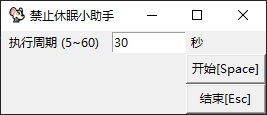

# StopWindowsSleep

>一个模拟鼠标随机移动，用于避免系统锁屏的小软件

通过python启动一个定时器，定期模拟移动鼠标实现

所需的库见requirements.txt 在Windows10下测试通过

## 安装

`git clone https://github.com/LewisGu/StopWindowsSleep`  
`pip install -r requirements.txt`  

## 版本历史
### v1.3.0
1.  增加了开始与结束的快捷键
2.  优化了线程关闭，使其更安全
3.  增加了退出软件前检查线程并关闭的功能
4.  微调了界面控件尺寸
5.  完善了命令行输出日志的代码
### v1.2.0
1.  提供了完善的鼠标漫步功能
2.  可输入想设置的周期时间

#
